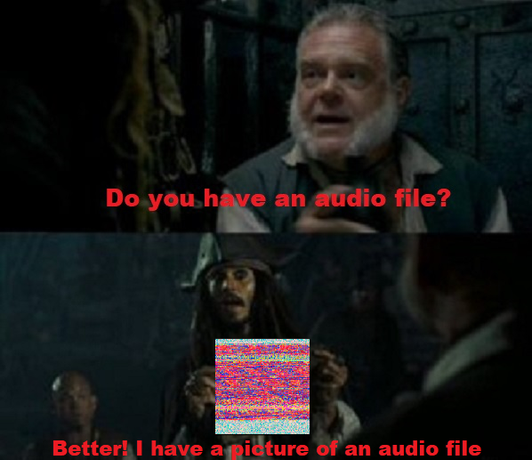
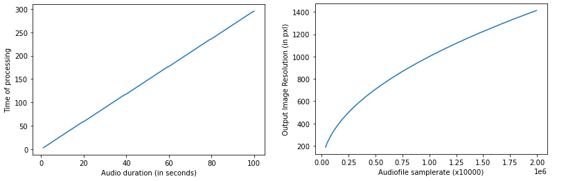
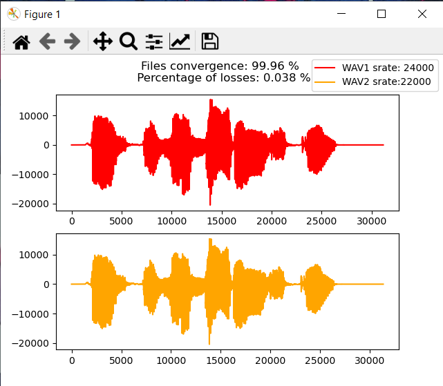
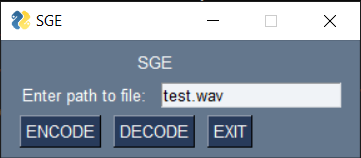

# SGE (Sound-Graphic Encoding)

## About project
Finishing my beer on Saturday night and watching a YouTube video about cryptography, I got a brilliant idea. Everything that is possible (text, NFT, etc.) has already been stitched into the Images. I decided to go a little further and stitch an audio file in a picture.

### As always, ready-made examples in the Examples folder

## Instructions for use:
1. Download the zip archive and unpack it wherever convenient.
2. Open the console and install the packages from **requierements.txt** with the command: `pip install -r requirements.txt`
3. Now with the command `python main.py` run the program.Now you need to specify the path to the file and choose what you want to do with it.**ENCODE** button will encode an audio file (only .wav format) and save it in the current directory.**DECODE** button will decode the image (only .png format) and save the resulting audio file in the current directory.The **EXIT** button converts the space-time continuum and closes the window.

## Warning!
The processing time and resolution of the output image directly depends on the size of the input file. So if you want to encrypt your girlfriend's voice for 5 minutes, you have to wait a couple of thousand years)) Be careful.

## Changes, people, changes!:
### --------------22.10.21--------------
Added a small module for comparing the received files.
Enter `python compare.py` in cmd to use

### --------------28.09.21--------------
Most of what I wanted has already been implemented. But here is a small list of recent changes.

1. Added GUI. Now it is more convenient to communicate with the program.

2. File processing is now handled by **ffmpeg**
3. And other minor improvements

## ToDo:
1. Optimize this ~~shit~~
2. Implement independence from the input file format